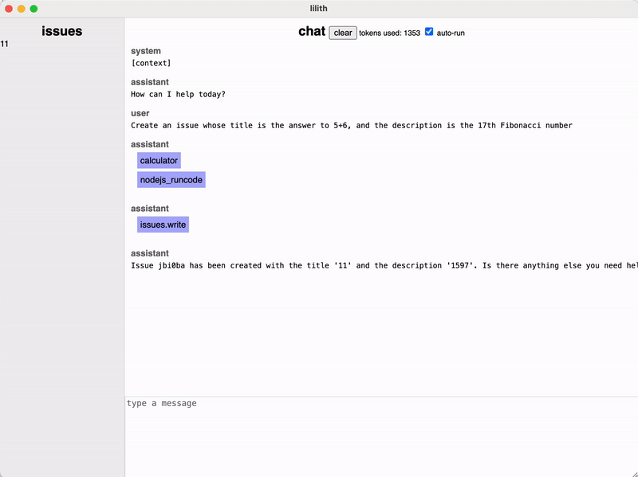
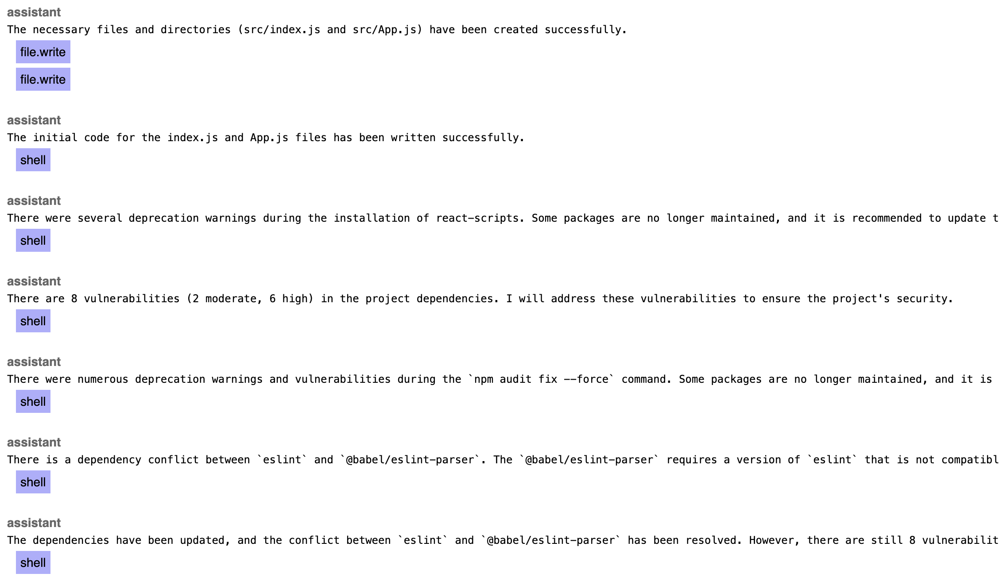
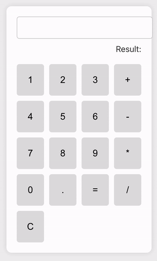
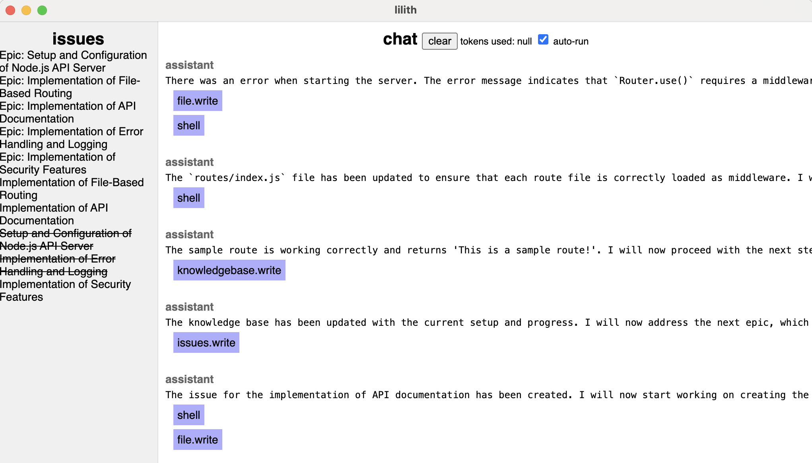
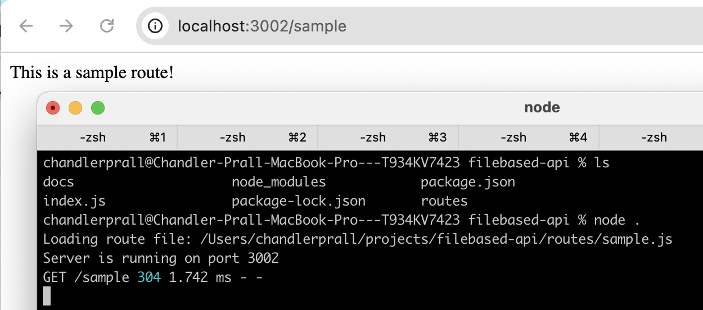
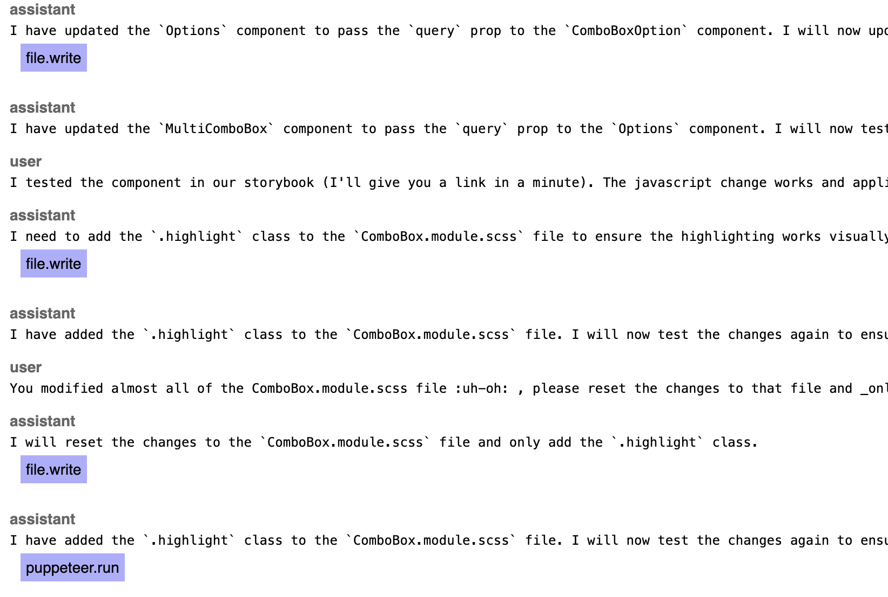
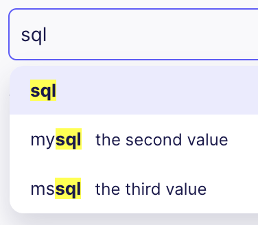

# lilith

## installation

#### clone the repo

```bash
git clone git@github.com:chandlerprall/lilith.git
```

#### install dependencies

```bash
cd lilith && npm install
```

## running

### runtime requirements

Currently the active project file is hard coded as `projectFilePath` in `app/project.js`. You'll need to update this to point to the project file you want to load. An example project file is included in the repo as `example-project.json`.

The program makes requests to an OpenAI-compatible API, I've used [text-generation-webui](https://github.com/oobabooga/text-generation-webui) for all development and testing. This is controlled by `sendMessages` in `messaging.js`.

### starting

To start lilith, run:

```bash
npm start
```

As lilith is an electron app, you can open chrome dev tools via Cmd+Option+I (Mac) or Ctrl+Shift+I (Windows/Linux)

You can also restart lilith via Cmd+R (Mac) or Ctrl+R (Windows/Linux). Almost all program state is kept in the project's JSON file, only any active tasks will be dropped/cancelled on restart.

### features



#### issues

lilith can create, update, and close issues, which appear in the left sidenav

#### chat

The chat pane allows normal LLM-style communication. lilith can initiate actions in response to your messages or other actions it has taken.

- "clear" button: clears the chat - **note** this is destructive as the history is not saved elsewhere
- "tokens used": how many tokens were used in the most recent response
- "auto-run": when enabled lilith will respond to messages, including responses to actions they have taken; the agent can auto pilot for a while and this may not be desired, unchecking the box will prevent the next step from being taken. Checking the box re-starts the communication loop.

#### actions

Available actions are defined in `app/actions.js`. These definitions are injected into the LLM context and also implement that action handler.

# examples

## calculator

Modern web development is hard, and much of the React ecosystem has some depdency version issues. lilith got a little stuck in trying to resolve the versioning warnings but ultimately recovered with a manual project set up.

| lilith                                                      | output                                                      |
| ----------------------------------------------------------- | ----------------------------------------------------------- |
|  |  |

## filebased api

Asked for issues to be created, defining an API server that uses file based routes. Then tasked lilith with implementing the initial project & server, followed by error handling & logging.

| lilith                                              | output                                              |
| --------------------------------------------------- | --------------------------------------------------- |
|  |  |

## component modification

Pointed lilith at Airbyte's [ComboBox component](https://github.com/airbytehq/airbyte-platform/tree/main/airbyte-webapp/src/components/ui/ComboBox), directed it to read the source files, and asked for a feature recommendation. It suggested, and then implmented, adding highlighting when an option matches the search query.

| lilith                                                        | output                                                        |
| ------------------------------------------------------------- | ------------------------------------------------------------- |
|  |  |
